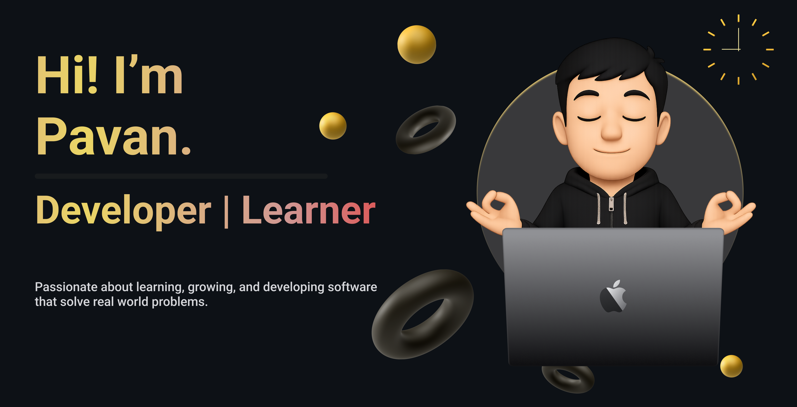

  

# Hi, I’m Pavan 👋  

I’m a computer science undergrad who is passionate about **building full-stack apps, exploring AI/ML**, and making complex ideas easier to learn.  
Some technologies I enjoy working with include **Next.js, FastAPI, PostgreSQL**, and increasingly, **cloud tools on AWS**.  

Lately, I’ve been diving deeper into how cloud and AI can come together to build scalable, human-centered applications.  
When I’m not coding, you’ll probably find me experimenting in the kitchen 🍳 — because learning (and failing!) is just as fun outside tech too.  

## Find me around the web 🌍
- Sharing thoughts and updates on [LinkedIn](https://www.linkedin.com/in/pavan-raj-in) 
- Geeking out with projects here on GitHub   
- Cooking up a personal site soon 🍴  

✨ Thanks for stopping by! Always happy to connect and learn together.  

